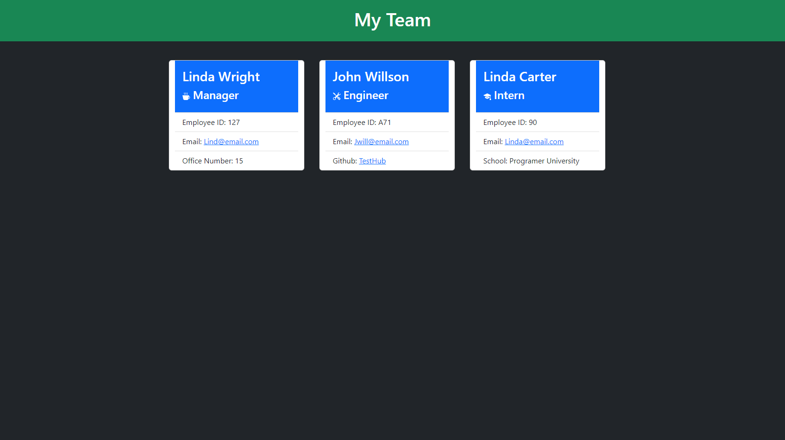

# Team Profile Generator

## Table of contents

---

> [Description](#description)
>
> [Installation](#installation)
>
> [Usage](#usage)
>
> [Licenses](#licenses)
>
> [Contributions](#contributions)
>
> [Tests](#tests)
>
> [Questions](#questions)

## Description

---

This is a javascript application that uses inquirer prompts to gather information about a programming/engineering team. With prompts for the team manager as well as prompts to add as many enigneers and interns as the user would like. The application prompts for the employees' names, empoyee id, and email. It then also prompts for a different piece of information depending on the employee's position, prompting for the managers office number, an engineers github username and an interns school. The application then compiles these responses and dynmaiclly creates card elements for each entry set. Once the user chooses to no longer enter any more employees the program then generates an html document that has all the information that the user input displayed in a convient manner with each entry set having a card of it's own.

[Team Profile Generator Walkthrough](https://drive.google.com/file/d/1hBmUbRd9KV9jRCt4-vlTVYtMt2y3alPg/view?usp=sharing)

## Usage

---

This application can be used to keep contact information for a group of employees to allow the user to pull up and view when needed.

## Installation

---

Download the application, run npm i to download the dependcies and run node index.js

## License

---

Licensed with the ISC license : 

## Contributions

---

Used for this project were bootstrap for design jest for tests, and inquirer for prompts.

## Tests

---

Jest tests were used to make sure that the various constructor functions were all working properly and inheriting functions correctly.

## Questions

---

If you have any questions you can reach out on my GitHub at:

[GitHub](https://github.com/TateFoster)

or email me at:

[tate.j.foster@gmail.com](mailto:tate.j.foster@gmail.com)
